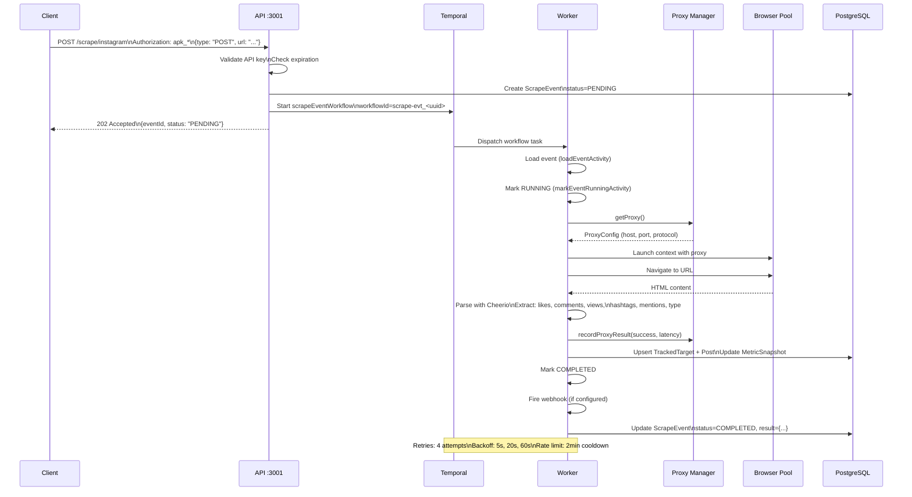

# Scraping App Architecture

## Current System Overview

```mermaid
graph TB
    subgraph "Client Layer"
        UI[Dashboard :5173\nReact + Vite]
        API_CLIENT[External Clients\nAPI Key: apk_*]
    end

    subgraph "API Layer :3001\nHono + Bun"
        subgraph "Routes"
            TARGETS[/api/v1/targets\nGET, POST, PATCH]
            POSTS[/api/v1/posts\nGET with filters]
            SCRAPE_LEGACY[/api/v1/scrape\nPOST targetId + options]
            SCRAPE_IG[/scrape/instagram\nPOST URL + type]
            SCRAPE_THREADS[/scrape/threads\nPOST URL + type]
            JOBS_LEGACY[/api/jobs\nLegacy dashboard compat]
        end
        AUTH[Auth Middleware\napk_* validation]
        TEMPORAL_CLIENT[Temporal Client\nWorkflow dispatch]
    end

    subgraph "Message Queue / Orchestration"
        TEMPORAL[Temporal Server :7233\nPostgreSQL backend]
        TEMPORAL_UI[Temporal UI :8233]
    end

    subgraph "Worker Layer\nBun + Temporal Worker"
        WORKER[Temporal Worker\nscraping-queue]
        subgraph "Workflows"
            WF_JOB[scrapeWorkflow\nJob-based scraping]
            WF_EVENT[scrapeEventWorkflow\nEvent-driven scraping]
        end
        subgraph "Activities"
            ACT_LOAD[loadJob/EventActivity]
            ACT_RUN[runScraperActivity\nPlaywright + Cheerio]
            ACT_SAVE[savePosts/ResultActivity]
            ACT_WEBHOOK[fireWebhookActivity]
            ACT_MARK[markRunning/Completed/Failed]
        end
        PROXY[Proxy Manager\nRotation + Health]
        BROWSER[Browser Pool\nShared Chromium]
    end

    subgraph "Data Layer\nPostgreSQL"
        DB[(PostgreSQL :5432)]
        subgraph "Core Models"
            USER[User]
            APIKEY[ApiKey]
            WEBHOOK[Webhook]
            TARGET[TrackedTarget]
            METRIC[MetricSnapshot]
            POST[Post]
            COMMENT[Comment]
            JOB[ScrapeJob]
            SCRAPED[ScrapedPost]
            EVENT[ScrapeEvent]
            PROXY_CFG[ProxyConfig]
        end
    end

    %% Client connections
    UI -->|REST| TARGETS
    UI -->|REST| POSTS
    UI -->|REST| JOBS_LEGACY
    API_CLIENT -->|REST + apk_*| SCRAPE_IG
    API_CLIENT -->|REST + apk_*| SCRAPE_THREADS

    %% Auth
    SCRAPE_IG --> AUTH
    SCRAPE_THREADS --> AUTH

    %% API to Temporal
    SCRAPE_LEGACY --> TEMPORAL_CLIENT
    SCRAPE_IG --> TEMPORAL_CLIENT
    SCRAPE_THREADS --> TEMPORAL_CLIENT

    %% Temporal
    TEMPORAL_CLIENT --> TEMPORAL
    TEMPORAL --> WORKER
    TEMPORAL_UI -.-> TEMPORAL

    %% Worker internals
    WORKER --> WF_JOB
    WORKER --> WF_EVENT
    WF_JOB --> ACT_LOAD
    WF_JOB --> ACT_RUN
    WF_JOB --> ACT_SAVE
    WF_JOB --> ACT_MARK
    WF_EVENT --> ACT_LOAD
    WF_EVENT --> ACT_RUN
    WF_EVENT --> ACT_SAVE
    WF_EVENT --> ACT_MARK
    WF_EVENT --> ACT_WEBHOOK

    %% Scraper deps
    ACT_RUN --> PROXY
    ACT_RUN --> BROWSER
    PROXY --> DB
    BROWSER --> ACT_RUN

    %% Data access
    TARGETS --> DB
    POSTS --> DB
    SCRAPE_LEGACY --> DB
    SCRAPE_IG --> DB
    SCRAPE_THREADS --> DB
    ACT_LOAD --> DB
    ACT_SAVE --> DB
    ACT_MARK --> DB
    ACT_WEBHOOK -.-> DB

    %% Styling
    classDef api fill:#e3f2fd,stroke:#1976d2,stroke-width:2px;
    classDef worker fill:#f3e5f5,stroke:#7b1fa2,stroke-width:2px;
    classDef data fill:#e8f5e9,stroke:#388e3c,stroke-width:2px;
    classDef temporal fill:#fff3e0,stroke:#f57c00,stroke-width:2px;
    classDef client fill:#fce4ec,stroke:#c2185b,stroke-width:2px;

    class TARGETS,POSTS,SCRAPE_LEGACY,SCRAPE_IG,SCRAPE_THREADS,JOBS_LEGACY,AUTH,TEMPORAL_CLIENT api;
    class WORKER,WF_JOB,WF_EVENT,ACT_LOAD,ACT_RUN,ACT_SAVE,ACT_WEBHOOK,ACT_MARK,PROXY,BROWSER worker;
    class DB,USER,APIKEY,WEBHOOK,TARGET,METRIC,POST,COMMENT,JOB,SCRAPED,EVENT,PROXY_CFG data;
    class TEMPORAL,TEMPORAL_UI temporal;
    class UI,API_CLIENT client;
```

## Data Flow: Instagram Scrape Request



## Key Components

| Layer | Technology | Purpose |
|-------|------------|---------|
| **API** | Hono + Bun | REST endpoints, auth, validation, Temporal dispatch |
| **Orchestration** | Temporal | Workflow execution, retries, durability, visibility |
| **Worker** | Bun + Temporal Worker | Activity execution, scraping, proxy/browser management |
| **Scrapers** | Playwright + Cheerio | Instagram/Threads rendering + parsing |
| **Proxy** | Custom pool | Rotation, health checks, weighted selection |
| **Browser** | Playwright Chromium | Shared headless browser pool |
| **Database** | PostgreSQL + Prisma | All persistent state |
| **Dashboard** | React + Vite + TanStack Query | Real-time job monitoring |

## Workflow Comparison

| Aspect | `scrapeWorkflow` (Job-based) | `scrapeEventWorkflow` (Event-based) |
|--------|------------------------------|--------------------------------------|
| **Trigger** | POST `/api/v1/scrape` (targetId) | POST `/scrape/instagram\|threads` (URL) |
| **Auth** | Session (dashboard) | API Key (apk_*) |
| **Input** | Target reference + options | Direct URL + type |
| **Output** | ScrapedPost (per-job table) | Post + MetricSnapshot (persistent) |
| **Webhook** | No | Yes (on completion/failure) |
| **Use Case** | Dashboard manual scrapes | External integrations, automation |
